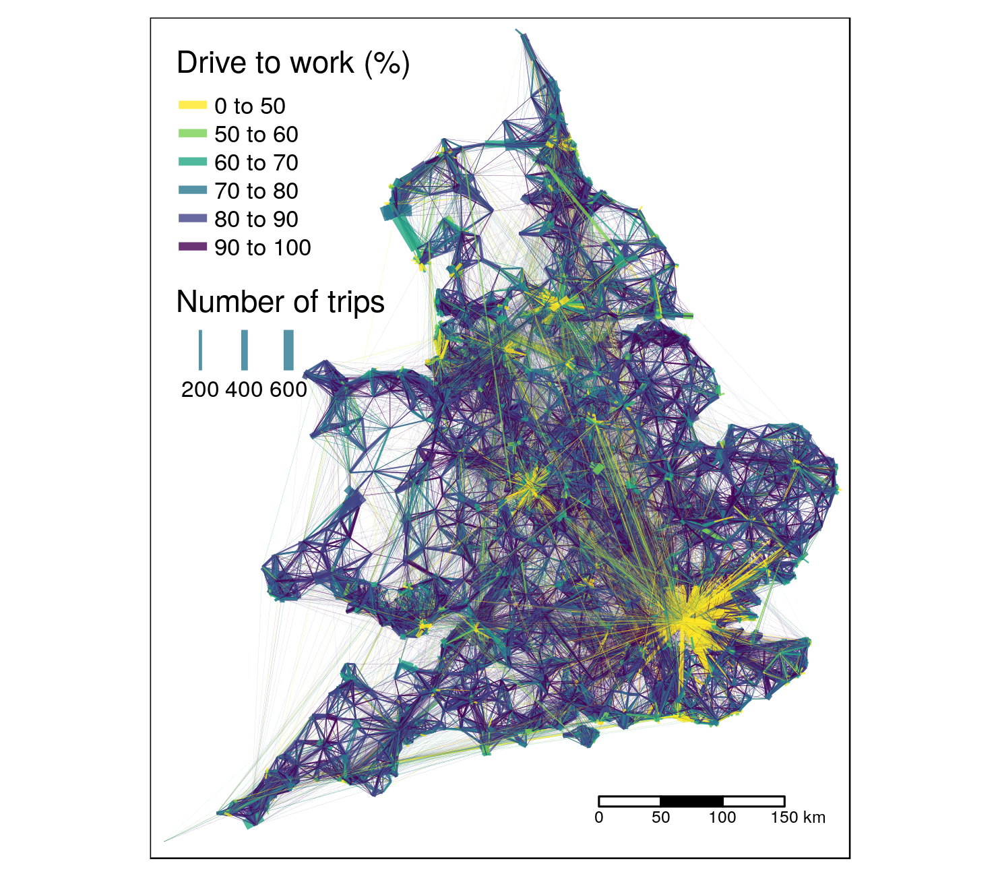
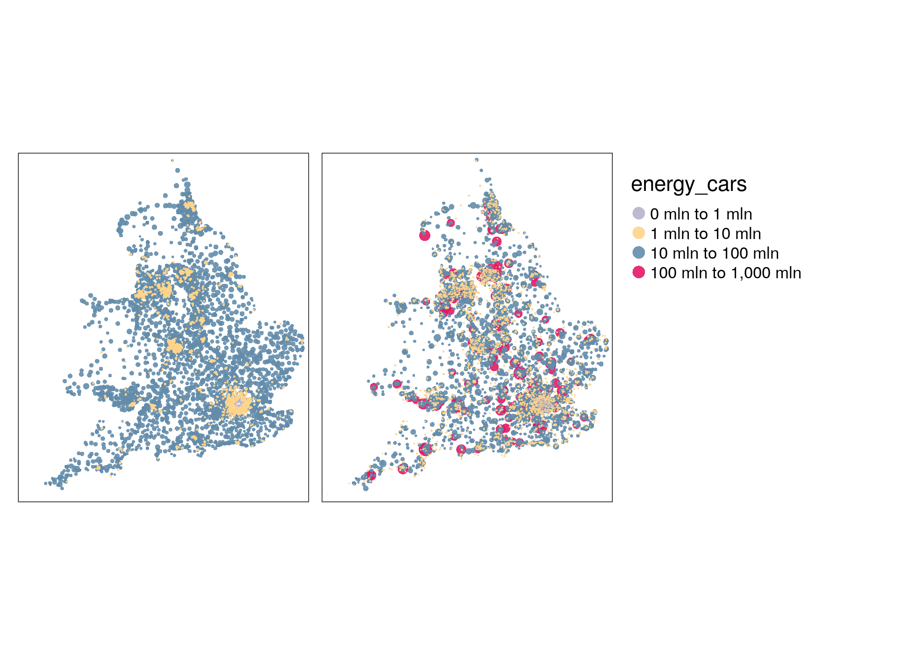

<!-- README.md is generated from README.Rmd. Please edit that file -->

```{r setup, include = FALSE}
knitr::opts_chunk$set(
  collapse = TRUE,
  comment = "#>",
  fig.path = "man/figures/README-",
  out.width = "100%",
  eval = FALSE,
  echo = FALSE
)
```

```{r, eval=FALSE, echo=FALSE}
citr::tidy_bib_file(rmd_file = "README.Rmd", messy_bibliography = "allrefs.bib", file = "od.bib")
```


# Notes

*This paper is work in progress. Comments and suggested changes are welcome.*

See the .Rmd file that contains the source code to reproduce the results (code not shown by default)

```{r setuppkgs}
# Note: these packages must be installed to reproduce the results
library(pct)
library(sf)
library(stplanr)
library(tidyverse)
library(tmap)
```


## Papers to cite

We should probably cite these papers (please add more):

- Paper on OD data for geodemographics: http://www.sciencedirect.com/science/article/pii/S0198971516303301

<!-- [@martin_origin-destination_2018] -->

- [@alexander_validation_2015; @he_simple_2018; @munuzuri_estimation_2004]


# Introduction

<!--
Draft suggestion for a new first paragraph (see comments below)
-->
Passenger transport is one of the main sources of energy use, especially personal cars (reference?). We analyse and visualise passenger transport data from the UK in order to understand which modes of transport are being used across the country. The aim of the study is to enable policy makers to invest in infrastucture which enables low-energy modes of transport, such as public transport and cycling.


Energy use is an inherently ephemeral phenomenon.
Although, as the second law of thermodynamics states, energy cannot be created or destroyed, *useful energy* in the fossil fuel age exists only during the relatively short span between non-renewable sources being extracted and burned.
In the coming renewable energy age, useful energy will exist for even less time, between conversion of environmental energy fluxes into electricity, transmission, and comparatively costly temporary storage.
The second law of thermodynamics tells us that what we call energy use is in fact energy conversion, and every conversion results in less useful energy, in continuous and ubiquitous energy converters with varying power levels and load profiles.
In the context of passenger transport, the prime example of these conversions is in the privately owned car, often the most powerful energy converter people have access to.
<!--
* I suggest to move this paragraph a bit further. In my opinion, the first paragraph should be a to-the-point summary of our paper. This paragraph is about the physics of energy, which is more background. I added a new first paragraph as suggestion.
* Also, it was quite difficult for me to read, and probably also for other non-native-English/non-specilist-in-energy people. Specifically:
  * A few diffucult words which I had to look up: ephemeral and ubiquitous. Could be due to my bad English.
  * This paragraph is basically a summary of physics about energy. For non-specialists like me, it took me some time to digest, and also raises some questions, such as 
    * What happens with the non-useful energy?
    * How does energy conversion work?
    * What exactly is renewable and non-renewable energy?
* 'the privately owned car': I assume that rental cars are just as bad.
-->


The act of travel involves moving across geographic space.
Because of this, policies to address unsustainably high levels transport energy use can target three main areas:
trip origins, typically residential locations where journeys begin; trip destinations, typically 'trip generators' such as school, hospitals and work places where trips end; and places in between, typically transport infrastructure.
Of these three potential areas for policy intervention, most of the focus has been on the first.
This makes sense from a citizen-focussed policy perspective, enabling residential areas with excessive transport energy use to be identified.
However, from an energy systems perspective, it makes sense to identify opportunties across all three areas to intervene.
Transport infrastructure can be modified to enable shift to low energy modes and encourage reductions in long distance travel; destinations can discourage driving and flying to reach them through parking costs and subsidising public transport modes to work, to provide a couple of examples.

The spatially distributed nature of transport energy use makes it not only possible, but also useful to analyse it across geographic space.
We analyse geographic transport behaviour by using aggregated origin-destionation data (OD data), which contains the numbers of people travelling from origin to destination via intermediate points, by mode of transport.
This paper sets out a case for analysing and visualising transport analysis at this OD level.

- Something on different levels of energy analysis.

- Something on visualisation of spatial phenomena, e.g. building on [@rae_spatial_2009]

# Levels of visualisation

OD datasets are 'implicitly geographic': their coordinates are not contained in the data, but associated with another data object, typically a zone or a zone centroid.
An example demonstrating OD data is shown below, which respresents 2.4 million desire lines at the MSOA-MSOA level in England and Wales.
The dataset shows the overall travel to work patterns across the UK, based on 21.6 million people in which both origin and destination were reported in the 2011 Census.
This represents 81% of all commuters in the open access origin-destination data contained in the file `wu03ew_v2.csv`, which can be downloaded from http://wicid.ukdataservice.ac.uk/ as follows:

```{r}
od_data_all = pct::get_od()

# remove intra-zonal
cents_ew = pct::get_centroids_ew()
od_data_inter = od_data_all[
  od_data_all$geo_code1 %in% cents_ew$msoa11cd &
  od_data_all$geo_code2 %in% cents_ew$msoa11cd ,
  ]

# subset lines to speed-up od2line function
# od_cars = od_data_all[od_data_all$car_driver >= 5, ] # 440000 lines
od_cars = od_data_inter[od_data_inter$all >= 10, ] # 360695 lines
sum(od_cars$all) / sum(od_data_inter$all) # represents 80% of all inter-zonal flow 

lines_cars = od2line(od_cars, cents_ew)
plot(lines_cars[1:999, ])
lines_cars$euclidean_distance_m = as.numeric(sf::st_length(lines_cars)) / 1000
lines_cars$car_km = lines_cars$car_driver * lines_cars$euclidean_distance_m
summary(lines_cars$car_driver)
```

by the number of car km used for travel to work, which can be downloaded, read-in and plotted as follows:


```{r, out.width="100%", warning=FALSE}
download.file(url = "https://github.com/ropensci/stplanr/releases/download/0.2.9/desire_lines_cars.Rds", "desire_lines_cars.Rds")
lines_cars = readRDS("desire_lines_cars.Rds")

lines_cars$`Drive to work (%)` = lines_cars$car_driver / lines_cars$all * 100
# plot(lines_cars["car_km"], lwd = lines_cars$car_km / 1000)
sum(lines_cars$all)
lines_cars$energy_cars = lines_cars$car_km *
      2.5 * # average energy use per vehicle km 
      220 * # estimated number of commutes/yr
      2.6   # circuity (estimated at 1.3) multiplied by 2 

lines_cars_top = lines_cars %>% 
  top_n(n = 100000, wt = energy_cars)
  # top_n(n = 100000, wt = energy_cars)
```


```{r}
m = tm_shape(lines_cars_top) +
  tm_lines(palette = "-viridis", breaks = c(0, 50, 60, 70, 80, 90, 100), 
    lwd = "all",
    lwd.legend = c(200, 400, 600),
    scale = 15,
    title.lwd = "Number of trips",
    alpha = 0.8,
    col = "Drive to work (%)"
  ) +
  tm_scale_bar()
tmap_save(m, "overview_map1.png")

```

```{r, eval=TRUE, echo=FALSE}

```


Based on the estimate of the average energy use per km being 2.5 MJ, and that these return trips are made on average 200 times per year, with a circuity of 1.3, we can estimate the total energy use of the 'high energy commutes' as follows:

```{r}
pj_to_mtoe = 41.86
56.5 * pj_to_mtoe
sum(lines_cars$energy_cars / 1e9) / (56.5 * pj_to_mtoe) * 100 # 12% of transport energy use
sum(lines_cars_top$energy_cars / 1e9) / (56.5 * pj_to_mtoe) * 100 # 1.4% of transport energy use
```

That represents ~10 petajoules (PJ), only for the top 20,000 most energy intensive commutes.
That may seem like alot, but represents only a fraction of the UK's total energy use of [~200 Mtoe](https://assets.publishing.service.gov.uk/government/uploads/system/uploads/attachment_data/file/729451/DUKES_PN.pdf) (8400 PJ).

## Zone of origin

The energy use presented at the OD level in the previous section can be aggregated to the zone leve.


## Zone of destination

## Centroids 

An issue with visualising zonal data on geographic maps is that the results can over-emphasise attributes large, rural areas [@ref].

```{r}
zones_attr = lines_cars %>% 
  st_drop_geometry() %>% 
  group_by(geo_code1) %>% 
  summarize_if(is.numeric, sum) %>% 
  dplyr::rename(msoa11cd = geo_code1)

zones_joined = left_join(cents_ew, zones_attr)

zones_od = lines_cars %>% 
  st_drop_geometry() %>% 
  select(msoa11cd = geo_code2, energy_cars_dest = energy_cars) %>% 
  group_by(msoa11cd) %>% 
  summarize_if(is.numeric, sum) %>% 
  inner_join(zones_joined, .)


plot(zones_od[c("energy_cars", "energy_cars_dest")])


m = tm_shape(zones_od) +
  tm_dots(c("energy_cars", "energy_cars_dest"), size = c("energy_cars", "energy_cars_dest"), pal = "Accent", alpha = 0.9, 
          legend.size.show	= FALSE,
          # midpoint = 200e6,
          # style = "quantile",
          breaks = c(0, 1, 10, 100, 1000) * 1e6
          ) +
  tm_facets(free.scales = FALSE)
tmap_save(m, "energy_origins_destinations.png")
```

```{r, echo=FALSE, eval=TRUE}

```

## Visualising desires lines

## Desire lines

## Desire lines with direction

## Routes

## Route networks

# Next steps

A next step for this will be to compare 'high energy origins' and 'high energy destinations' with other energy-related variables.

We will also look at the impact of using route distances rather than straight line distances with an average cirquity.

# Route analysis

```{r, echo=FALSE, eval=FALSE}
# route data from Malcolm
piggyback::pb_list()
piggyback::pb_download("top10000routes.Rds")
piggyback::pb_download("top10000routes_missing.Rds")
r = readRDS("top10000routes.Rds")
r_missing = readRDS("top10000routes_missing.Rds")
r = rbind(r, r_missing)
# saveRDS(r, "routes-all-100000.Rds")
# piggyback::pb_upload("routes-all-100000.Rds")
names(r)
r_top = r %>% 
  filter(fromPlace %in% lines_cars_top$geo_code1) %>% 
  filter(toPlace %in% lines_cars_top$geo_code2) 
plot(r_top[1:999, "mode"])
names(lines_cars_top)

# # fails as from/to reversed:
# r_joined = r_top %>%
#   rename(geo_code1 = toPlace, geo_code2 = fromPlace) %>% 
#   inner_join(., sf::st_drop_geometry(lines_cars_top)) 
r_joined2 = r_top %>%
  rename(geo_code2 = toPlace, geo_code1 = fromPlace) %>% 
  inner_join(., sf::st_drop_geometry(lines_cars_top)) %>% 
  sf::st_zm()

names(r_joined2)
rnet = stplanr::overline2(r_joined2, "car_driver")
```

# Route network analysis

# References


