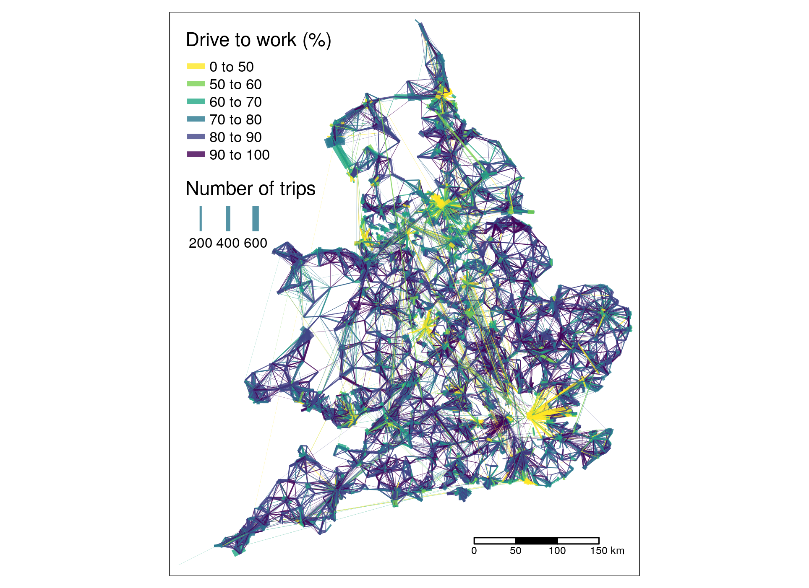

Visualising transport energy use: from area to route network levels
================

<!-- README.md is generated from README.Rmd. Please edit that file -->

<!-- # Notes -->

<!-- *This paper is work in progress. Comments and suggested changes are welcome.* -->

<!-- See the .Rmd file that contains the source code to reproduce the results (code not shown by default) -->

<!-- ## Papers to cite -->

<!-- We should probably cite these papers (please add more): -->

<!-- - Paper on OD data for geodemographics: http://www.sciencedirect.com/science/article/pii/S0198971516303301 -->

<!-- [@martin_origin-destination_2018] -->

<!-- - [@alexander_validation_2015; @he_simple_2018; @munuzuri_estimation_2004] -->

# Introduction

<!--
Draft suggestion for a new first paragraph (see comments below)
-->

Passenger transport was — before the physical distancing measures and
movement restrictions introduced in response to the Covid-19 Pandemic
(e.g. Wilder-Smith and Freedman 2020; Mitjà et al. 2020; Jarvis et al.
2020) — a major, rapidly growing and particularly difficult-to-mitigate
source of energy use and emissions (Gül et al. 2009; Moriarty and
Honnery 2016; Gota et al. 2019). Notwithstanding the potential for
societal transformation it is possible, if not likely, that passenger
transport energy use will continue its upward trajectory when
restrictions on movement are relaxed.

However, passenger transport is rarely accounted-for in aggregate
statistics or thinking about energy use at national, let alone
sub-national levels. Too often energy policies completely ignore
transport. This paper aims to address these issues head-on, by
demonstrating the potential for geographic visualisation methods to
‘bring to life’ the energy (and resulting emissions) impacts of
transport, to inform thinking around and interventions enabling the
rapid decarbonisation of the sector. The use of progressively more
detailed visualisation techniques, from time series of sectoral energy
use trajectories (including uncertainty of the future) to ‘route
network’ energy use plots that can show energy use down to the road
segment level to flag the role of carbon-intensive infrastructure is
illustrated in the results, building on a national origin-destination
dataset based on the UK’s 2011 Census.

Globally, land-based passenger transport accounted for around 3.6 Gt CO2
in 2018, 11% of the global total. Passenger land transport is the single
largest sub-sector within the transport sector with passenger, road
freight, aviation, shipping and other modes accounting for 45%, 30%,
11%, 11% and 3%, of the sector’s emissions respectively, omitting the
increased impact of high altitude emissions from flying, accounting for
45% of transport emissions (Sims et al. 2014).\[1\] The focus of the
paper is on the UK, where the gap between projections of future
emissions and the necessary cuts, to reach zero carbon by 2050, is
larger than for other sectors (Department for Transport 2020). The UK is
not necessarily representative of the global situation, but represents a
good case study country due to the provision of national open access
origin-destination data at high levels of geographic resolution
(Lovelace et al. 2017). The challenges that the UK’s passenger transport
sector faces from an emissions perspective, including high level of car
dependency and under-investment in and capacity limits on public
transport (Anable 2005; Pisu, Pels, and Bottini 2015), are not unique to
Northern Europe.

<!-- [@zhang_role_2020] -->

<!-- We analyse and visualise passenger transport data from the UK in order to understand which modes of transport are being used across the country. The aim of the study is to enable policy makers to invest in infrastructure which enables low-energy modes of transport, such as public transport and cycling. -->

# Visualising transport energy use

<!-- This is the literature review -->

Energy use is an inherently ephemeral phenomenon. Although, as the
second law of thermodynamics states, energy cannot be created or
destroyed, *useful energy* in the fossil fuel age exists only during the
relatively short span between non-renewable sources being extracted and
burned. In the coming renewable energy age, useful energy will exist for
even less time, between conversion of environmental energy fluxes into
electricity, transmission, and comparatively costly temporary storage.
The second law of thermodynamics tells us that what we call energy use
is in fact energy conversion, and every conversion results in less
useful energy, in continuous and ubiquitous energy converters with
varying power levels and load profiles. In the context of passenger
transport, the prime example of these conversions is in the privately
owned car, often the most powerful energy converter people have access
to. <!--
* I suggest to move this paragraph a bit further. In my opinion, the first paragraph should be a to-the-point summary of our paper. This paragraph is about the physics of energy, which is more background. I added a new first paragraph as suggestion.
* Also, it was quite difficult for me to read, and probably also for other non-native-English/non-specialist-in-energy people. Specifically:
  * A few difficult words which I had to look up: ephemeral and ubiquitous. Could be due to my bad English.
  * This paragraph is basically a summary of physics about energy. For non-specialists like me, it took me some time to digest, and also raises some questions, such as 
    * What happens with the non-useful energy?
    * How does energy conversion work?
    * What exactly is renewable and non-renewable energy?
* 'the privately owned car': I assume that rental cars are just as bad.
-->

The act of travel involves moving across geographic space. Because of
this, policies to address excessively high levels transport energy use
can target three main areas: trip origins, typically residential
locations where journeys begin; trip destinations, typically ‘trip
generators’ such as school, hospitals and work places where trips end;
and places in between, typically transport infrastructure. Of these
three potential areas for policy intervention, most of the focus has
been on the first. This makes sense from a citizen-focussed policy
perspective, enabling residential areas with excessive transport energy
use to be identified. However, from an energy systems perspective, it
makes sense to identify opportunities across all three areas to
intervene. Transport infrastructure can be modified to enable shift to
low energy modes and encourage reductions in long distance travel;
destinations can discourage driving and flying to reach them through
parking costs and subsidising public transport modes to work, to provide
a couple of examples.

The spatially distributed nature of transport energy use makes it not
only possible, but also useful to analyse it across geographic space. We
analyse geographic transport behaviour by using aggregated
origin-destination data (OD data), which contains the numbers of people
travelling from origin to destination via intermediate points, by mode
of transport. This paper sets out a case for analysing and visualising
transport analysis at this OD level.

  - Something on different levels of energy analysis.

  - Something on visualisation of spatial phenomena, e.g. building on
    (Rae 2009)

# Data and methods

…

# Levels of visualisation

## Time series plots

## Origin-destination data

OD datasets are ‘implicitly geographic’: their coordinates are not
contained in the data, but associated with another data object,
typically a zone or a zone centroid. An example demonstrating OD data is
shown below, which represents 2.4 million desire lines at the MSOA-MSOA
level in England and Wales. The dataset shows the overall travel to work
patterns across the UK, based on 21.6 million people in which both
origin and destination were reported in the 2011 Census. This represents
81% of all commuters in the open access origin-destination data
contained in the file `wu03ew_v2.csv`, which can be downloaded from
<http://wicid.ukdataservice.ac.uk/> as follows:

by the number of car km used for travel to work, which can be
downloaded, read-in and plotted as follows:

Based on the estimate of the average energy use per km being 2.5 MJ, and
that these return trips are made on average 200 times per year, with a
circuity of 1.3, we can estimate the total energy use of the ‘high
energy commutes’ as follows:

That represents \~10 petajoules (PJ), only for the top 20,000 most
energy intensive commutes. That may seem like a lot, but represents only
a fraction of the UK’s total energy use of [\~200
Mtoe](https://assets.publishing.service.gov.uk/government/uploads/system/uploads/attachment_data/file/729451/DUKES_PN.pdf)
(8400 PJ).

## Zone of origin

The energy use presented at the OD level in the previous section can be
aggregated to the zone level.

## Zone of destination

## Centroids

An issue with visualising zonal data on geographic maps is that the
results can over-emphasise attributes large, rural areas
(**???**).

## Visualising desires lines

## Desire lines

## Desire lines with direction

## Routes

## Route networks

# Discussion and conclusion

A next step for this will be to compare ‘high energy origins’ and ‘high
energy destinations’ with other energy-related variables.

We will also look at the impact of using route distances rather than
straight line distances with an average circuity.

# References

Anable, Jillian. 2005. “‘Complacent Car Addicts’ or ‘Aspiring
Environmentalists’? Identifying Travel Behaviour Segments Using Attitude
Theory.” *Transport Policy* 12 (1): 65–78.
<https://doi.org/10.1016/j.tranpol.2004.11.004>.

Department for Transport. 2020. “Decarbonising Transport: Setting the
Challenge.” Department for Transport.

Gota, Sudhir, Cornie Huizenga, Karl Peet, Nikola Medimorec, and Stefan
Bakker. 2019. “Decarbonising Transport to Achieve Paris Agreement
Targets.” *Energy Efficiency* 12 (2): 363–86.

Gül, Timur, Socrates Kypreos, Hal Turton, and Leonardo Barreto. 2009.
“An Energy-Economic Scenario Analysis of Alternative Fuels for
Personal Transport Using the Global Multi-Regional MARKAL Model (GMM).”
*Energy* 34 (10): 1423–37.
<https://doi.org/10.1016/j.energy.2009.04.010>.

Jarvis, Christopher I., Kevin Van Zandvoort, Amy Gimma, Kiesha Prem,
Petra Klepac, G. James Rubin, W. John Edmunds, and CMMID COVID-19
working group. 2020. “Quantifying the Impact of Physical Distance
Measures on the Transmission of COVID-19 in the UK.” *medRxiv*.

Lovelace, Robin, Anna Goodman, Rachel Aldred, Nikolai Berkoff, Ali
Abbas, and James Woodcock. 2017. “The Propensity to Cycle Tool: An Open
Source Online System for Sustainable Transport Planning.” *Journal of
Transport and Land Use* 10 (1). <https://doi.org/10.5198/jtlu.2016.862>.

Mitjà, Oriol, Àlex Arenas, Xavier Rodó, Aurelio Tobias, Joe Brew, and
José M. Benlloch. 2020. “Experts’ Request to the Spanish Government:
Move Spain Towards Complete Lockdown.” *The Lancet*.

Moriarty, Patrick, and Damon Honnery. 2016. “Global Transport Energy
Consumption.” *Alternative Energy and Shale Gas Encyclopedia. NY: John
Wiley and Sons*, 651–56.

Pisu, Mauro, Barbara Pels, and Novella Bottini. 2015. “Improving
Infrastructure in the United Kingdom.” *OECD Economics Department
Working Papers*, no. 1244.
<https://doi.org/https://doi.org/https://doi.org/10.1787/5jrxqbqc7m0p-en>.

Rae, Alasdair. 2009. “From Spatial Interaction Data to Spatial
Interaction Information? Geovisualisation and Spatial Structures of
Migration from the 2001 UK Census.” *Computers, Environment and Urban
Systems* 33 (3): 161–78.
<https://doi.org/10.1016/j.compenvurbsys.2009.01.007>.

Sims, Ralph, Roberto Schaeffer, F. Creutzig, X. Cruz-Núñez, M. D’agosto,
D. Dimitriu, M. J. Figueroa Meza, L. Fulton, S. Kobayashi, and O. Lah.
2014. “Transport Climate Change 2014: Mitigation of Climate Change.
Contribution of Working Group III to the Fifth Assessment Report of the
Intergovernmental Panel on Climate Change Ed O Edenhofer et Al.”
*Cambridge and New York: Cambridge University Press. Available at:
Http://Www. Ipcc.
Ch/Pdf/Assessment-Report/Ar5/Wg3/Ipcc\_wg3\_ar5\_chapter8. Pdf*.

Wilder-Smith, A., and D. O. Freedman. 2020. “Isolation, Quarantine,
Social Distancing and Community Containment: Pivotal Role for Old-Style
Public Health Measures in the Novel Coronavirus (2019-nCoV) Outbreak.”
*Journal of Travel Medicine* 27 (2): taaa020.

1.   See the International Energy Agency’s interactive transport energy
    emissions tracker at
    <https://www.iea.org/reports/tracking-transport-2019> for details.
